# Blog Application - Architecture & Planning Diagrams

## Application Architecture

## Component Flow Diagram

## Navigation Flow

## CRUD Operations Flow

## Routes Structure

## Data Model Structure

## Responsive Design Breakpoints

```mermaid
flowchart LR
    Mobile["📱 Mobile<br/>320px - 767px"] --> Tablet["📱 Tablet<br/>768px - 1023px"]
    Tablet --> Desktop["💻 Desktop<br/>1024px+"]
    
    Mobile -.->|Layout| MLayout["Single Column<br/>Stacked Cards<br/>Full-width Forms"]
    Tablet -.->|Layout| TLayout["2-Column Grid<br/>Compact Cards<br/>Optimized Forms"]
    Desktop -.->|Layout| DLayout["3-Column Grid<br/>Expanded Cards<br/>Side-by-side Layout"]
    
    style Mobile fill:#4caf50,color:#fff
    style Tablet fill:#2196f3,color:#fff
    style Desktop fill:#9c27b0,color:#fff
```

## Technology Stack

